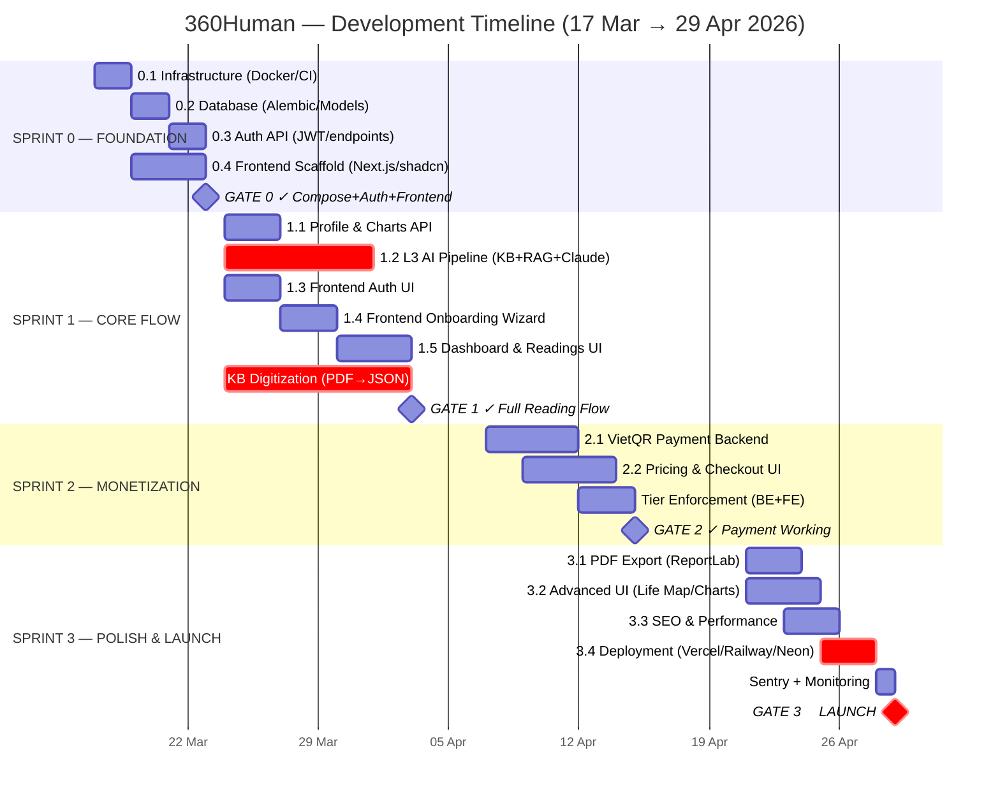
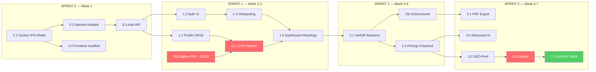
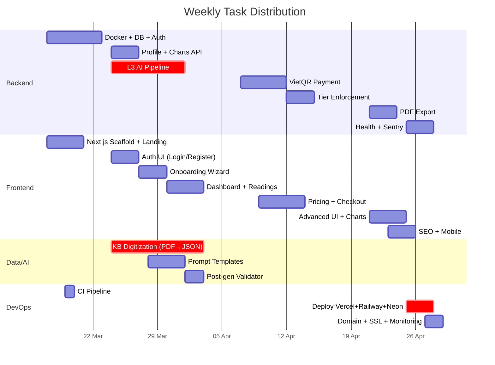
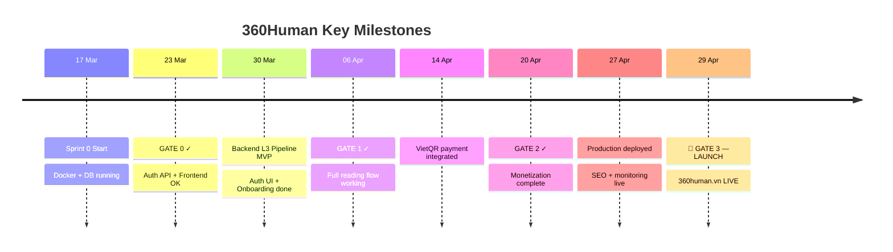

# 360Human — Gantt Chart

> Launch: **29/04/2026** | Team: **1 fullstack dev (Winston)** | Total: **105 tasks**
> Render: Paste into any Mermaid-compatible viewer (GitHub, VSCode Mermaid Preview, mermaid.live)

## Master Gantt



## Dependency Map



## Critical Path (Red = Blocker)

```
Docker → Alembic → Auth API → Profile CRUD → L3 AI Pipeline → Dashboard → Payment → Deploy → 🚀
                                                    ↑
                                            KB Digitization (PDF→JSON)
```

**Longest chain: 38 days** (17 Mar → 29 Apr) — zero slack on critical path.

## Task Breakdown by Week



## Resource Allocation (1 Fullstack Dev)

| Week | Dates | Focus | Hours/day |
|------|-------|-------|-----------|
| W1 | 17-23 Mar | **Backend heavy:** Docker, DB, Auth API + Frontend scaffold | BE 70% / FE 30% |
| W2 | 24-30 Mar | **Parallel:** L3 Pipeline + Auth UI + Onboarding | BE 50% / FE 40% / AI 10% |
| W3 | 31 Mar - 6 Apr | **Frontend heavy:** Dashboard + Readings + KB digitize | FE 50% / AI 40% / BE 10% |
| W4 | 7-13 Apr | **Backend heavy:** VietQR payment + Tier enforcement | BE 60% / FE 40% |
| W5 | 14-20 Apr | **Frontend:** Pricing + Checkout + Profile + Settings | FE 70% / BE 30% |
| W6 | 21-27 Apr | **Polish:** PDF + Advanced UI + SEO + Deploy | FE 40% / BE 30% / Ops 30% |
| W7 | 28-29 Apr | **Launch:** Final QA + Go-live | Ops 80% / Fix 20% |

## Risk Heatmap

| Risk | Probability | Impact | Mitigation |
|------|-------------|--------|------------|
| KB digitization takes >10 days | 🔴 High | 🔴 Critical | Start Day 1 of Sprint 1. Prioritize Tử Vi + Numerology first (highest user demand) |
| API rate limits hit during dev | 🟡 Medium | 🟡 Medium | Cache aggressively (Redis permanent TTL for L1 data) |
| VietQR verification edge cases | 🟡 Medium | 🟡 Medium | Manual verification fallback + admin panel |
| Single dev burnout (7 weeks straight) | 🔴 High | 🔴 Critical | Strict P0-only in Weeks 1-4. Cut P2 tasks if behind |
| Claude API output quality inconsistent | 🟡 Medium | 🔴 Critical | Post-gen validator + structured prompts + few-shot examples |

## Milestones & Deliverables



## How to View These Charts

1. **VSCode:** Install "Markdown Preview Mermaid Support" extension → Open Preview (Ctrl+Shift+V)
2. **GitHub:** Push to repo → GitHub renders Mermaid natively in `.md` files
3. **Online:** Paste Mermaid blocks at [mermaid.live](https://mermaid.live)
4. **Notion:** Use `/mermaid` block and paste chart code
