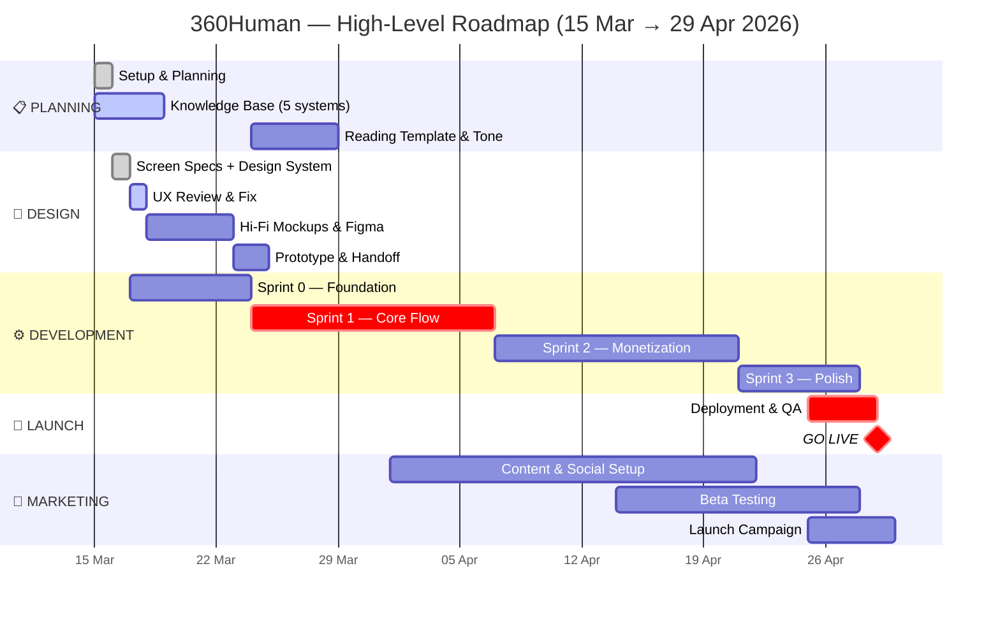
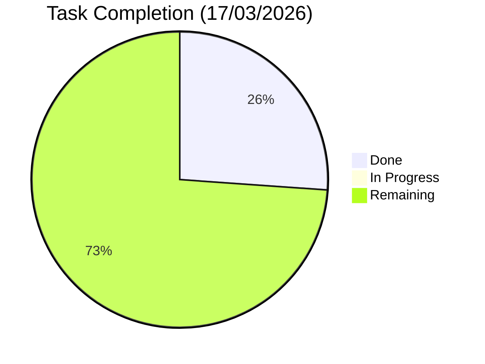
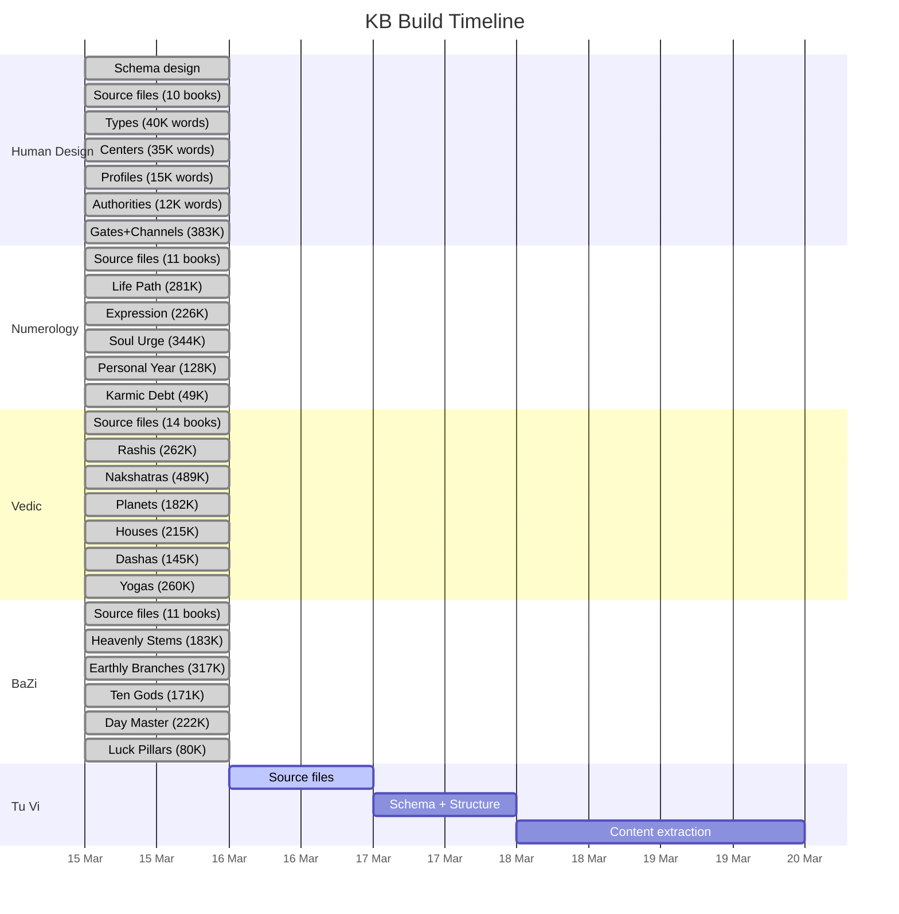
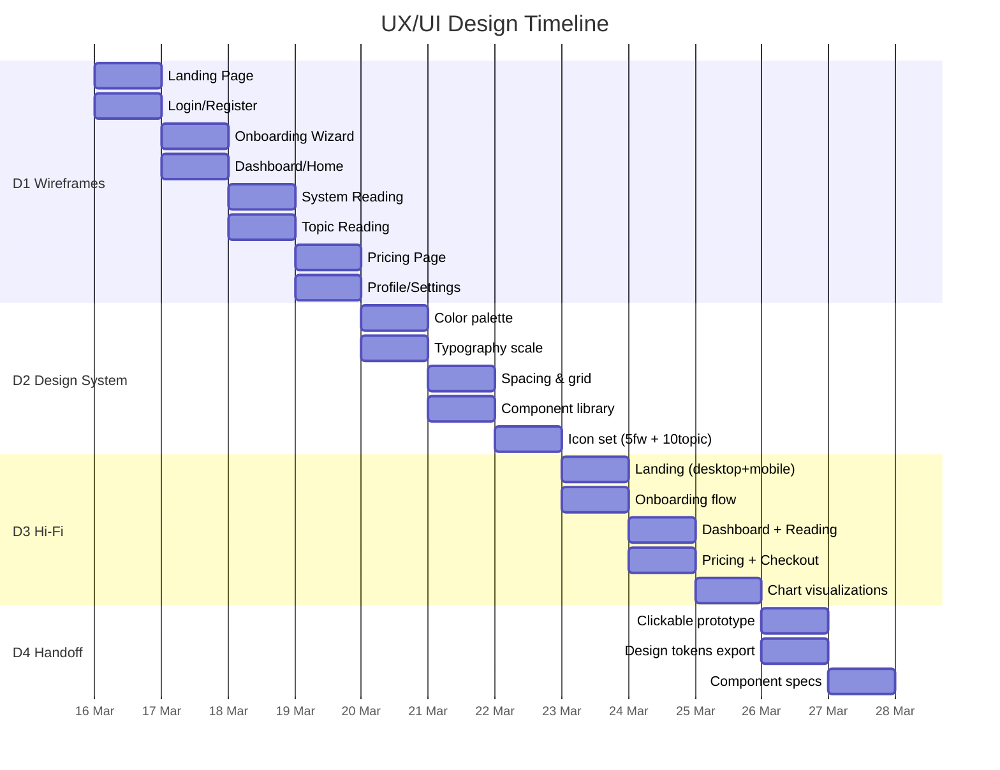
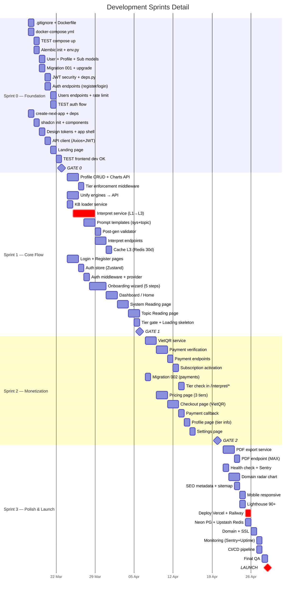
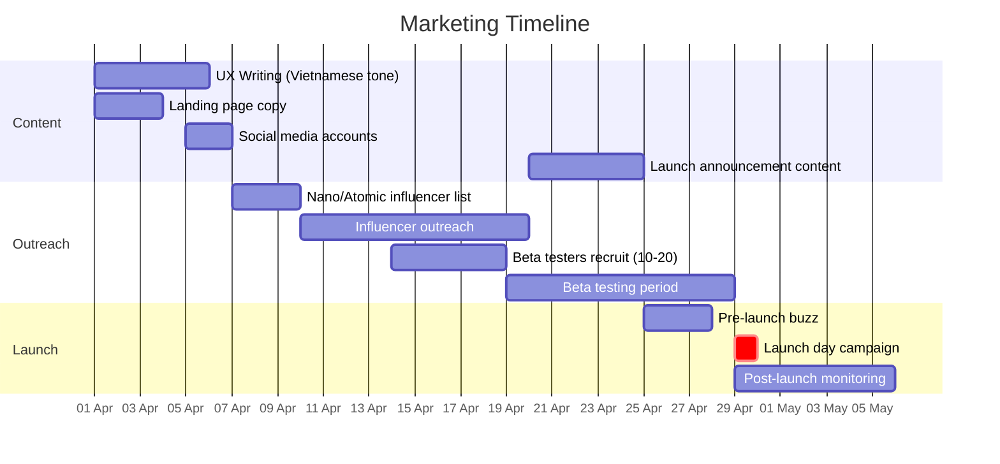

# 360Human — Master Project Tracker

> **Launch:** 29/04/2026 | **Team:** Winston (CEO/Fullstack) | **Domain:** 360human.vn (purchased)
> **Updated:** 17/03/2026

---

## HIGH-LEVEL GANTT — Bird's Eye View



---

## DETAIL GANTT — All Workstreams

```mermaid
gantt
    title 360Human — Full Project (15 Mar → 29 Apr 2026)
    dateFormat  YYYY-MM-DD
    axisFormat  %d %b
    todayMarker stroke-width:3px,stroke:#f00

    section PRE-SPRINT (Setup)
    Project Planning & Docs           :done, ps1, 2026-03-15, 1d
    Skills & Agents Setup (.agents)   :done, ps2, 2026-03-15, 1d
    Docx→MD Conversion                :done, ps3, 2026-03-15, 1d
    API Key (astrology-api.io)        :done, ps4, 2026-03-15, 1d
    Domain Registration (360human.vn) :done, ps5, 2026-03-15, 1d
    KB Schema Design                  :done, ps6, 2026-03-15, 1d

    section KNOWLEDGE BASE
    KB: Human Design (486K words)     :done, kb1, 2026-03-15, 1d
    KB: Numerology (1M words)         :done, kb2, 2026-03-15, 1d
    KB: Vedic (1.5M words)            :done, kb3, 2026-03-15, 1d
    KB: BaZi (973K words)             :done, kb4, 2026-03-15, 1d
    KB: Tu Vi (2M words)               :done, kb5, 2026-03-16, 1d
    KB: Reading Test & Tone           :done, kb6, 2026-03-15, 1d
    KB: Reading Template v6           :active, kb7, 2026-03-15, 2d

    section UX/UI DESIGN
    Screen Specs (10 screens)         :done, d1, 2026-03-16, 1d
    Design System + Components        :done, d2, 2026-03-16, 1d
    UX Review & Resolve               :active, d2b, 2026-03-17, 1d
    Hi-Fi Mockups (Figma)             :d3, 2026-03-18, 5d
    Prototype & Handoff               :d4, after d3, 2d

    section SPRINT 0 — FOUNDATION
    0.1 Infrastructure (Docker/CI)    :s01, 2026-03-17, 2d
    0.2 Database (Alembic/Models)     :s02, after s01, 2d
    0.3 Auth API (JWT/endpoints)      :s03, after s02, 2d
    0.4 Frontend Scaffold (Next.js)   :s04, after s01, 4d
    GATE 0 ✓                         :milestone, g0, after s03 s04, 0d

    section SPRINT 1 — CORE FLOW
    1.1 Profile & Charts API          :s11, 2026-03-24, 3d
    1.2 L3 AI Pipeline (RAG+Claude)   :crit, s12, 2026-03-24, 8d
    1.3 Frontend Auth UI              :s13, 2026-03-24, 3d
    1.4 Onboarding Wizard             :s14, after s13, 3d
    1.5 Dashboard & Readings UI       :s15, after s14, 4d
    GATE 1 ✓                         :milestone, g1, after s12 s15, 0d

    section SPRINT 2 — MONETIZATION
    2.1 VietQR Payment Backend        :s21, 2026-04-07, 5d
    2.2 Pricing & Checkout UI         :s22, 2026-04-09, 5d
    Tier Enforcement (BE+FE)          :s23, after s21, 3d
    GATE 2 ✓                         :milestone, g2, after s22 s23, 0d

    section SPRINT 3 — POLISH & LAUNCH
    3.1 PDF Export                    :s31, 2026-04-21, 3d
    3.2 Advanced UI                   :s32, 2026-04-21, 4d
    3.3 SEO & Performance            :s33, 2026-04-23, 3d
    3.4 Deployment                    :crit, s34, 2026-04-25, 3d
    Monitoring & Go-live              :s35, after s34, 1d
    LAUNCH 🚀                        :milestone, crit, g3, 2026-04-29, 0d
```

---

## FULL CHECKLIST — All Teams

### PRE-SPRINT: Setup & Planning (15/03/2026)

| # | Task | Owner | Status | Date |
|---|------|-------|--------|------|
| PS.1 | [x] Project structure & folder setup | Winston | ✅ Done | 15/03 |
| PS.2 | [x] Docx → MD conversion (8 files) | Claude | ✅ Done | 15/03 |
| PS.3 | [x] .archive folder + naming convention | Claude | ✅ Done | 15/03 |
| PS.4 | [x] .agents setup (88 skills, 13 sub-agents) | Claude | ✅ Done | 15/03 |
| PS.5 | [x] API key (astrology-api.io) — saved in .env | Winston | ✅ Done | 15/03 |
| PS.6 | [x] Domain registration (360human.vn) | Winston | ✅ Done | 15/03 |
| PS.7 | [x] KB schema design (5 systems) | Claude | ✅ Done | 15/03 |
| PS.8 | [x] .gitignore + .env.example | Claude | ✅ Done | 15/03 |
| PS.9 | [x] PRD clarification (18 Q&A resolved) | Winston+Claude | ✅ Done | 15/03 |
| PS.10 | [x] Brand naming (360Human) | Winston | ✅ Done | 15/03 |
| PS.11 | [x] Gantt chart + Sprint tracker | Claude | ✅ Done | 15/03 |
| PS.12 | [x] Architecture docs updated (ARCH-001→004) | Claude | ✅ Done | 15/03 |

### KNOWLEDGE BASE: Content (15-18/03/2026)

| # | Task | Words | Status | Date |
|---|------|-------|--------|------|
| KB.1 | [x] Human Design KB (5 files) | 485,870 | ✅ Done | 15/03 |
| KB.2 | [x] Numerology KB (5 files) | 1,028,107 | ✅ Done | 15/03 |
| KB.3 | [x] Vedic KB (6 files) | 1,553,404 | ✅ Done | 15/03 |
| KB.4 | [x] BaZi KB (5 files) | 972,749 | ✅ Done | 15/03 |
| KB.5 | [x] Tu Vi KB (7 files) | 2,023,735 | ✅ Done | 16/03 |
| KB.6 | [x] Reading test (HD chart: Quynh) | — | ✅ Done | 15/03 |
| KB.7 | [x] Reading tone calibration (v1→v6) | — | ✅ Done | 15/03 |
| KB.8 | [ ] Reading template finalized | — | ⬜ Deferred → Sprint 1 | |
| KB.9 | [ ] Cross-system reading template | — | ⬜ Deferred → Sprint 1 | |
| | **KB TOTAL** | **6,063,865** | **✅ 5/5 systems COMPLETE** | |

### UX/UI DESIGN (16-25/03/2026)

| # | Task | Owner | Status | Date |
|---|------|-------|--------|------|
| D.1 | [x] Screen specs: S1 Landing Page | Winston+Claude | ✅ Done | 16/03 |
| D.2 | [x] Screen specs: S2 Login/Register | Winston+Claude | ✅ Done | 16/03 |
| D.3 | [x] Screen specs: S3 Onboarding | Winston+Claude | ✅ Done | 16/03 |
| D.4 | [x] Screen specs: S4 Dashboard (2-col + accordion) | Winston+Claude | ✅ Done | 16/03 |
| D.5 | [x] Screen specs: S5 System Reading (interactive) | Winston+Claude | ✅ Done | 16/03 |
| D.6 | [x] Screen specs: S6 Topic Reading → merged into S4 | Winston+Claude | ✅ Done | 16/03 |
| D.7 | [x] Screen specs: S7 Pricing Page | Winston+Claude | ✅ Done | 16/03 |
| D.8 | [x] Screen specs: S8 Profile/Settings (+multi-profile) | Winston+Claude | ✅ Done | 16/03 |
| D.9 | [x] Screen specs: S9 Time Oracle (drill-down) | Winston+Claude | ✅ Done | 16/03 |
| D.10 | [x] Screen specs: S10 Action Items (pyramid) | Winston+Claude | ✅ Done | 16/03 |
| D.11 | [x] Design System v1 (colors, typography, texture, spacing) | Claude | ✅ Done | 16/03 |
| D.12 | [x] Component map v1 (shadcn/ui → 360Human) | Claude | ✅ Done | 16/03 |
| D.13 | [x] Vietnamese copy v1 (all screens) | Claude | ✅ Done | 16/03 |
| D.14 | [x] Figma research integrated (3 pages) | Winston+Claude | ✅ Done | 16/03 |
| D.15 | [x] UX review — 17 issues identified | Claude | ✅ Done | 16/03 |
| D.16 | [x] Review & resolve 17 UX issues (C1-C5, H1-H5, M1-M6) | Winston | ✅ Done | 17/03 |
| D.17 | [x] Fix all files based on review decisions | Claude | ✅ Done | 17/03 |
| D.18 | [x] **MAJOR: Tier collapse FREE/PRO/MAX → FREE/PRO** | Winston | ✅ Done | 17/03 |
| D.19 | [x] S4 restructure: 3-col → 2-col + accordion + inline actions | Claude | ✅ Done | 17/03 |
| D.20 | [x] S3→S4 loading merge (5-layer animation) | Claude | ✅ Done | 17/03 |
| D.21 | [x] S9 update: daily→weekly, FREE skip to Layer 3 | Claude | ✅ Done | 17/03 |
| D.22 | [x] S7 update: 2-tier pricing + checkout flow (VietQR) | Claude | ✅ Done | 17/03 |
| D.23 | [x] Navigation patterns + Error/Empty states added | Claude | ✅ Done | 17/03 |
| D.24 | [x] Design references desk research (FE-007, 12 sites) | Claude | ✅ Done | 17/03 |
| D.25 | [x] HTML wireframes built (FREE + PRO views) | Claude | ✅ Done | 17/03 |
| D.26 | [ ] Update 9 project files for tier collapse (ARCH, PRD, CEO) | Claude | 🔲 Next | |
| D.27 | [ ] Design system v2 (colors TBD after wireframe review) | Winston | 🔲 | |
| D.28 | [ ] Icon set (5 frameworks + 10 topics) | Winston | 🔲 | |
| D.29 | [ ] Hi-Fi Mockups / Figma | Winston | 🔲 | |
| D.30 | [ ] Design tokens export → CSS vars | Claude | 🔲 After D.27 | |

### SPRINT 0 — FOUNDATION (17-23/03/2026)

| # | Task | Owner | Priority | Status |
|---|------|-------|----------|--------|
| 0.1.1 | [ ] .gitignore (Python + Node + Docker) | Dev | P0 | ⬜ |
| 0.1.2 | [ ] backend/Dockerfile (Python 3.12) | Dev | P0 | ⬜ |
| 0.1.3 | [ ] docker-compose.yml (API + PG + Redis) | Dev | P0 | ⬜ |
| 0.1.4 | [ ] .dockerignore | Dev | P1 | ⬜ |
| 0.1.5 | [ ] CI pipeline (.github/workflows/ci.yml) | Dev | P2 | ⬜ |
| 0.1.6 | [ ] TEST: docker-compose up | Dev | P0 | ⬜ |
| 0.2.1 | [ ] alembic init | Dev | P0 | ⬜ |
| 0.2.2 | [ ] Configure env.py (async + PG) | Dev | P0 | ⬜ |
| 0.2.3 | [ ] User model (UUID, email, tier ENUM) | Dev | P0 | ⬜ |
| 0.2.4 | [ ] Profile model (birth data, lat/lon) | Dev | P0 | ⬜ |
| 0.2.5 | [ ] Subscription model | Dev | P0 | ⬜ |
| 0.2.6 | [ ] Generate migration 001 | Dev | P0 | ⬜ |
| 0.2.7 | [ ] alembic upgrade head | Dev | P0 | ⬜ |
| 0.2.8 | [ ] Remove create_all() from main.py | Dev | P1 | ⬜ |
| 0.3.1 | [ ] Install deps (jose, passlib, slowapi) | Dev | P0 | ⬜ |
| 0.3.2 | [ ] core/security.py (JWT HS256) | Dev | P0 | ⬜ |
| 0.3.3 | [ ] api/deps.py (get_current_user) | Dev | P0 | ⬜ |
| 0.3.4 | [ ] api/auth.py (register, login, refresh) | Dev | P0 | ⬜ |
| 0.3.5 | [ ] api/users.py (GET/PUT /users/me) | Dev | P0 | ⬜ |
| 0.3.6 | [ ] Rate limiting (slowapi) | Dev | P1 | ⬜ |
| 0.3.7 | [ ] Structured logging (structlog) | Dev | P1 | ⬜ |
| 0.3.8 | [ ] TEST: register → login → GET /me | Dev | P0 | ⬜ |
| 0.4.1 | [ ] create-next-app (Next.js 15, App Router) | Dev | P0 | ⬜ |
| 0.4.2 | [ ] Install deps (Axios, Zustand, TanStack) | Dev | P0 | ⬜ |
| 0.4.3 | [ ] shadcn init + Tailwind v4 | Dev | P0 | ⬜ |
| 0.4.4 | [ ] Add shadcn components | Dev | P0 | ⬜ |
| 0.4.5 | [ ] Design tokens (CSS vars) | Dev | P0 | ⬜ |
| 0.4.6 | [ ] App shell layout | Dev | P0 | ⬜ |
| 0.4.7 | [ ] API client (Axios + JWT interceptor) | Dev | P0 | ⬜ |
| 0.4.8 | [ ] Landing page | Dev | P0 | ⬜ |
| 0.4.9 | [ ] TEST: localhost:3000 OK | Dev | P0 | ⬜ |

### SPRINT 1 — CORE FLOW (24/03 - 06/04/2026)

| # | Task | Owner | Priority | Status |
|---|------|-------|----------|--------|
| 1.1.1 | [ ] Profile CRUD endpoints | Dev | P0 | ⬜ |
| 1.1.2 | [ ] Chart generation endpoint | Dev | P0 | ⬜ |
| 1.1.3 | [ ] Tier enforcement middleware | Dev | P0 | ⬜ |
| 1.1.4 | [ ] Unify engines → astrology-api.io | Dev | P0 | ⬜ |
| 1.2.1 | [ ] KB loader service | Dev | P0 | ⬜ |
| 1.2.2 | [ ] KB integration (all 5 systems) | Dev | P0 | ⬜ |
| 1.2.5 | [ ] Interpret service (L1→L1.5→L2→L3) | Dev | P0 | ⬜ |
| 1.2.6 | [ ] Prompt: system reading | Dev | P0 | ⬜ |
| 1.2.7 | [ ] Prompt: topic reading | Dev | P0 | ⬜ |
| 1.2.8 | [ ] Post-gen validator | Dev | P1 | ⬜ |
| 1.2.9 | [ ] Interpret endpoints | Dev | P0 | ⬜ |
| 1.2.10 | [ ] Cache L3 output (Redis 30d) | Dev | P0 | ⬜ |
| 1.3.1 | [ ] Login page | Dev | P0 | ⬜ |
| 1.3.2 | [ ] Register page | Dev | P0 | ⬜ |
| 1.3.3 | [ ] Auth store (Zustand) | Dev | P0 | ⬜ |
| 1.3.4 | [ ] Auth middleware | Dev | P0 | ⬜ |
| 1.4.1 | [ ] Wizard container (5-step) | Dev | P0 | ⬜ |
| 1.4.2 | [ ] Birth data form | Dev | P0 | ⬜ |
| 1.4.3 | [ ] City search (autocomplete) | Dev | P0 | ⬜ |
| 1.4.5 | [ ] Submit → create profile | Dev | P0 | ⬜ |
| 1.5.1 | [ ] Dashboard / Home page | Dev | P0 | ⬜ |
| 1.5.3 | [ ] System Reading page | Dev | P0 | ⬜ |
| 1.5.5 | [ ] Topic Reading page | Dev | P0 | ⬜ |
| 1.5.7 | [ ] Interpret hook (TanStack Query) | Dev | P0 | ⬜ |
| 1.5.8 | [ ] Tier gate component (blur + CTA) | Dev | P0 | ⬜ |
| 1.5.9 | [ ] Loading skeleton (shimmer) | Dev | P1 | ⬜ |

### SPRINT 2 — MONETIZATION (07-20/04/2026)

| # | Task | Owner | Priority | Status |
|---|------|-------|----------|--------|
| 2.1.1 | [ ] VietQR service (QR + txn code) | Dev | P0 | ⬜ |
| 2.1.2 | [ ] Payment verification service | Dev | P0 | ⬜ |
| 2.1.3 | [ ] Payment endpoints | Dev | P0 | ⬜ |
| 2.1.5 | [ ] Subscription activation | Dev | P0 | ⬜ |
| 2.1.6 | [ ] Migration 002 (payments table) | Dev | P0 | ⬜ |
| 2.1.7 | [ ] Tier check in /interpret/* | Dev | P0 | ⬜ |
| 2.2.1 | [ ] Pricing page (FREE/PRO) | Dev | P0 | ⬜ |
| 2.2.2 | [ ] Checkout page (VietQR) | Dev | P0 | ⬜ |
| 2.2.3 | [ ] Payment callback (success/fail) | Dev | P0 | ⬜ |
| 2.2.5 | [ ] Profile page (tier info) | Dev | P0 | ⬜ |
| 2.2.6 | [ ] Settings page | Dev | P1 | ⬜ |

### SPRINT 3 — POLISH & LAUNCH (21-29/04/2026)

| # | Task | Owner | Priority | Status |
|---|------|-------|----------|--------|
| 3.1.1 | [ ] PDF export service (ReportLab) | Dev | P0 | ⬜ |
| 3.1.2 | [ ] PDF endpoint (PRO tier) | Dev | P0 | ⬜ |
| 3.1.5 | [ ] Health check endpoint | Dev | P0 | ⬜ |
| 3.1.6 | [ ] Sentry integration | Dev | P0 | ⬜ |
| 3.2.5 | [ ] Domain radar chart (Recharts) | Dev | P1 | ⬜ |
| 3.3.1 | [ ] SEO metadata (per page) | Dev | P0 | ⬜ |
| 3.3.2 | [ ] Sitemap (next-sitemap) | Dev | P1 | ⬜ |
| 3.3.3 | [ ] Mobile responsive pass | Dev | P0 | ⬜ |
| 3.3.4 | [ ] Lighthouse 90+ | Dev | P1 | ⬜ |
| 3.4.1 | [ ] Deploy frontend → Vercel | Dev | P0 | ⬜ |
| 3.4.2 | [ ] Deploy backend → Railway | Dev | P0 | ⬜ |
| 3.4.3 | [ ] Setup Neon PostgreSQL (prod) | Dev | P0 | ⬜ |
| 3.4.4 | [ ] Setup Upstash Redis (prod) | Dev | P0 | ⬜ |
| 3.4.5 | [ ] Configure domain: 360human.vn | Dev | P0 | ⬜ |
| 3.4.6 | [ ] SSL certificate | Dev | P0 | ⬜ |
| 3.4.7 | [ ] Monitoring (Sentry + UptimeRobot) | Dev | P0 | ⬜ |
| 3.4.9 | [ ] CI/CD pipeline | Dev | P1 | ⬜ |

### MARKETING & LAUNCH (Parallel)

| # | Task | Owner | Status |
|---|------|-------|--------|
| M.1 | [ ] UX Writing finalized (Vietnamese tone) | Winston | ⬜ |
| M.2 | [ ] Landing page copy | Winston | ⬜ |
| M.3 | [ ] Nano/Atomic influencer outreach | Winston | ⬜ |
| M.4 | [ ] Social media accounts setup | Winston | ⬜ |
| M.5 | [ ] Beta testers recruitment (10-20 people) | Winston | ⬜ |
| M.6 | [ ] Launch announcement content | Winston | ⬜ |

---

## PROGRESS DASHBOARD



| Workstream | Total | Done | In Progress | Remaining |
|-----------|-------|------|-------------|-----------|
| Pre-Sprint Setup | 12 | 12 | 0 | 0 |
| Knowledge Base | 9 | 7 | 1 | 1 |
| UX/UI Design | 23 | 18 | 0 | 5 |
| Sprint 0 (Foundation) | 31 | 0 | 0 | 31 |
| Sprint 1 (Core Flow) | 26 | 0 | 0 | 26 |
| Sprint 2 (Monetization) | 11 | 0 | 0 | 11 |
| Sprint 3 (Launch) | 17 | 0 | 0 | 17 |
| Marketing | 6 | 0 | 0 | 6 |
| **TOTAL** | **135** | **37** | **1** | **97** |

---

## WEEKLY MILESTONES

| Week | Dates | Focus | Deliverable | Status |
|------|-------|-------|-------------|--------|
| W0 | 15-16 Mar | Setup + KB | Planning, KB 5/5, Domain | ✅ Done |
| W1 | 17-23 Mar | Foundation + Design | Docker + DB + Auth + Wireframes | 🟡 17/03: UX done, wireframes done, tier collapse done |
| W2 | 24-30 Mar | Core Backend + Auth UI | L3 Pipeline + Onboarding | ⬜ |
| W3 | 31 Mar-6 Apr | Core Frontend | Dashboard + Readings | ⬜ |
| W4 | 7-13 Apr | Payment | VietQR + Pricing | ⬜ |
| W5 | 14-20 Apr | Monetization | Checkout + Tier enforcement | ⬜ |
| W6 | 21-27 Apr | Polish + Deploy | PDF + SEO + Vercel/Railway | ⬜ |
| W7 | 28-29 Apr | 🚀 LAUNCH | 360human.vn LIVE | ⬜ |

---

## BLOCKERS

| Blocker | Impact | Status |
|---------|--------|--------|
| ~~API Key~~ | ~~All L1 computation~~ | ✅ Done |
| ~~Domain~~ | ~~Deployment~~ | ✅ 360human.vn purchased |
| ~~HD KB~~ | ~~HD readings~~ | ✅ 486K words |
| ~~Numerology KB~~ | ~~Num readings~~ | ✅ 1M words |
| ~~Vedic KB~~ | ~~Vedic readings~~ | ✅ 1.5M words |
| ~~BaZi KB~~ | ~~BaZi readings~~ | ✅ 973K words |
| ~~Tu Vi KB~~ | ~~Tu Vi readings~~ | ✅ 2M words |
| ~~Wireframes~~ | ~~Frontend implementation~~ | ✅ HTML wireframes (FREE + PRO) |
| Tier collapse update | 9 project files still reference MAX | 🔲 Next session |
| Design system v2 | Colors TBD (current wireframe = B&W) | 🔲 After wireframe review |
| Reading template | L3 prompt quality | 🔲 Sprint 1 |

---

## TODAY DONE (17/03/2026)

| # | Task | Impact |
|---|------|--------|
| 1 | UX Review 17 issues → all resolved | S4 2-col, accordion, inline actions |
| 2 | **Tier collapse: 3→2 tiers (FREE/PRO)** | PRO = everything, no MAX |
| 3 | FE-003, FE-004, FE-005 fully updated | All screens, design system, components |
| 4 | FE-007 Design References created | 12 sites researched, categorized |
| 5 | HTML wireframes (FREE + PRO views) | Clickable prototype in browser |
| 6 | Navigation patterns + Error states added | 3 layouts, 8 error states defined |

## NEXT SESSION — Plan

| Priority | Task | Notes |
|----------|------|-------|
| P0 | Update 9 project files for tier collapse | ARCH-001, ARCH-002, ARCH-004, PRD-001, CEO-002, etc. |
| P0 | Design system v2 — finalize colors | Wireframe hiện tại B&W, cần decide palette |
| P1 | Sprint 0 kickoff — Docker + DB | If design decisions settled |

---

## DETAIL GANTT — Per Workstream

### Knowledge Base Detail



### UX/UI Design Detail



### Development Sprint Detail



### Marketing & Launch Detail


